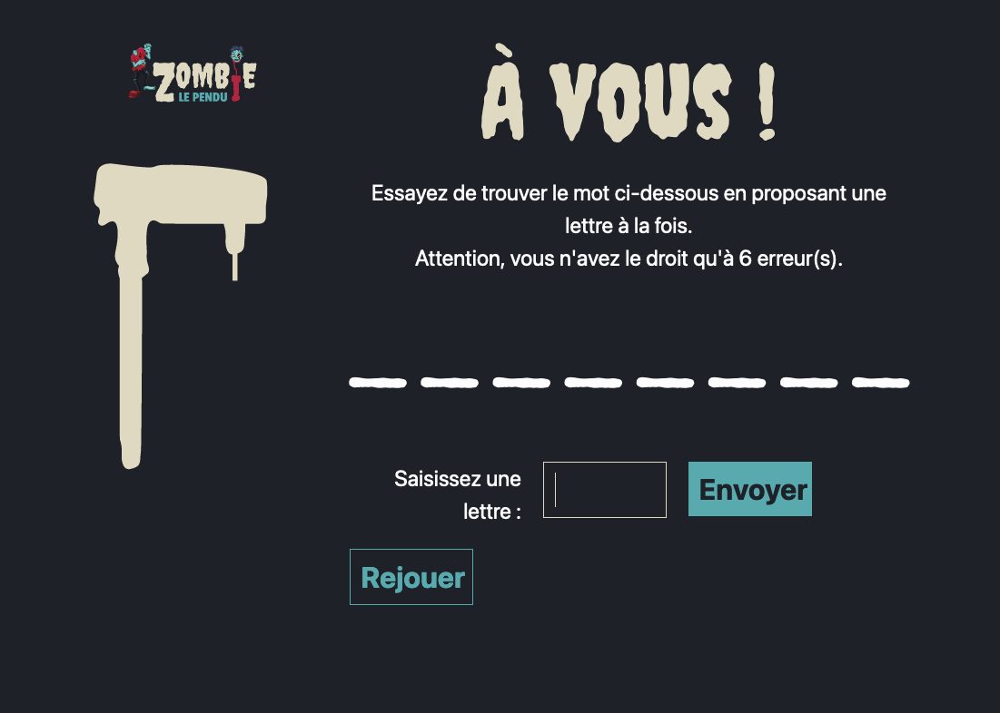

# Le jeu du pendu

Ce projet est une implémentation du jeu du pendu en PHP. 
L'utilisateur peut saisir une lettre à chaque tour pour essayer de deviner un mot. 
Le jeu comporte une limite de 6 erreurs avant de perdre. 

## Présentation des fichiers principaux :

- `"index.php"` : contrôlleur principale du jeu contenant toute la logique.
- `"hangman.php"` : librairie contenant quatre fonctions nécessaires au bon fonctionnement du jeu.
- `"index.phtml"` : librairie contenant quatre fonctions nécessaires au bon fonctionnement du jeu.

## Fonctionnalités

- Affichage du logo et de l'image de la potence du pendu.

- Gestion des différentes conditions de jeu (perdu, gagné, en cours).

- Affichage du mot à deviner avec les lettres trouvées et les lettres manquantes remplacées par des underscores.

- Saisie d'une lettre par l'utilisateur et envoi du formulaire.

- Affichage des lettres déjà proposées.

- Possibilité de rejouer en rechargeant la page.

## Principes

La logique du programme s'articule comme ceci :

1. Au début de la partie (premier round), un mot est choisi aléatoirement par l'ordinateur dans un dictionnaire de mots pré-enregistrés. On en mémorise l'index, qui est écrit dans un champ caché du formulaire pour le retrouver lors des rounds suivants.

2. Sont aussi enregistrées dans le formulaires en champ caché, les propositions faites par le joueur depuis le début de la partie sous la forme d'une chaîne de carctère contenant toutes les lettres saisies depuis le début. Cette chaîne est, bien entendu, vide en début de partie.

3. Lorsque le joueur saisi une lettre dans le seul champ disponible, cette lettre est récupérée et ajoutée à la liste de ses propositions.

4. On crée la chaîne de caractère qui sert d'indice au joueur pour connaître la position des lettres qu'il a déjà trouvé. Les lettres non trouvées sont remplacer par des `'_'` (undescore). Pour cela, on compare simplement le mot à trouver avec la liste des propositions du joueur. Par exemple, si le mot à trouver est `cheval` et que le joueur à déjà propose les lettres `aeiscl`, on obtiendra la chaîne `c_e_al`. Cette chaîne est identifiée par `"cluestring"` dans tout le programme. Elle est affichée dans le html final pour aider le joueur.

5. On compte les erreurs du joueur avec un algorithme similaire à celui permettant la création de la cluestring. Exemple : en gardant `cheval` comme mot à trouver et `aeiscl` comme propositions du joeurs, Le programme trouvera que le joueur à fit `2` erreurs. Ce nombre est vital puisqu'il permet de savoir quand le joueur à perdu et, surtout, d'afficher la bonne image pour le pendu (`"0.svg"` pour 0 erreur, `"1.svg"` pour 1 erreur, ...)

6. On vérifie si le joueur a perdu, si il y a 6 erreurs ou plus.

7. On vérifie si le joueur a gagné, si il n'y a plus de `'_'` dans la `cluestring`

8. Juste pour la propreté, le programme propose de changer la classe CSS de `cluestring` si celle-ci est trop longue, cela afin d'éviter de dépasser des bords de l'écran.

## Comment jouer

1. Ouvrez le fichier index.php dans votre navigateur.

2. Essayez de deviner le mot en proposant une lettre à la fois.

3. Attention, vous n'avez droit qu'à 6 erreurs avant de perdre.

